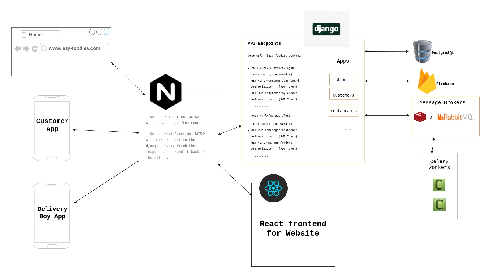

# Overview :
---
## Main Website 
url : www.​lazy-foodies​.com
This is the main website where both customers and restaurant managers can register/login. The registration for managers and customers will be different.
- When a Customer logs in, he/she can browse foods form nearest restaurants, order foods, view previous orders etc
- When a Restaurant Manager logs in, he/she will be redirected to his panel where he can manage his restaurant info, manage the deliver boys, manage discounts, view/update orders etc

## Customer App
This Mobile APP is for the customers where they can regsiter/login and order foods. They will have the same functionality like the main website (browse and order foods etc)

## Delivery Boy App
This Mobile APP is for the deliver boys where they can login and view the orders they are assigned to. They will get push notifications in the APP whenever there is a food delivery assigned to him. He can view order details to delivery the order to the customer and can update the status of the delivery once he delivered the food.

# Architecture
---
## Tech Stack 
Django, DRF, React, PostgreSQL, Redis, RabbitMQ, Celery, Gunicorn, NGINX

## Main Components
- Nginx - for HTTP server and reverse proxy
- React - front end for the Website
- Django/DRF Application - to serve the APIs
- PostgreSQL - to store application data
- Redis/RabbitMQ - to maintain the Task Queue
- Workers/Celery - 

## Diagram

