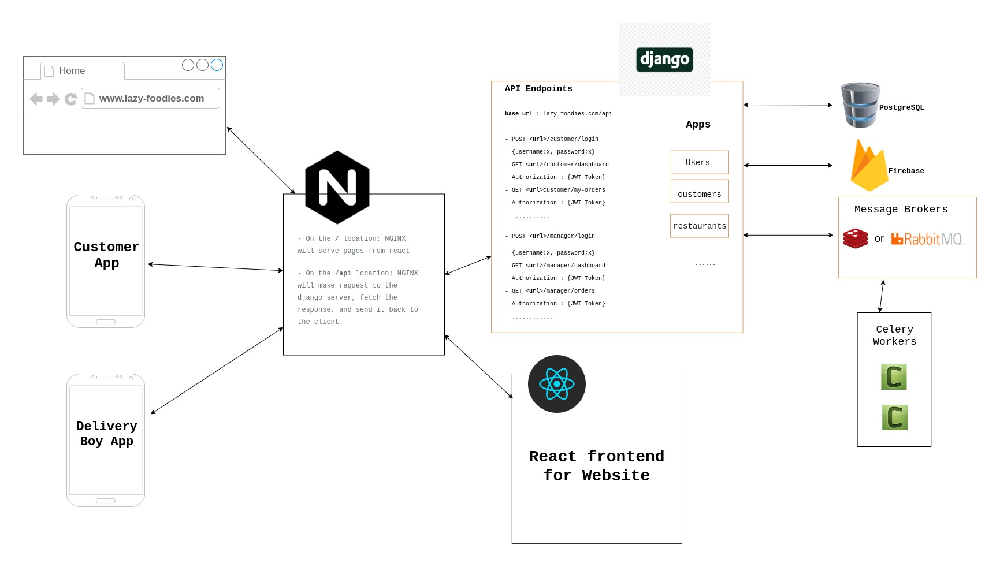

# Overview :

## Main Website 
url : www.​lazy-foodies​.com

This is the main website where both customers and restaurant managers can register/login. The registration for managers and customers will be different.
- When a Customer logs in, he/she can browse foods form nearest restaurants, order foods, view previous orders etc
- When a Restaurant Manager logs in, he/she will be redirected to his panel where he can manage his restaurant info, manage the deliver boys, manage discounts, view/update orders etc

## Customer App
This Mobile APP is for the customers where they can regsiter/login and order foods. They will have the same functionality like the main website (browse and order foods etc)

## Delivery Boy App
This Mobile APP is for the deliver boys where they can login and view the orders they are assigned to. They will get push notifications in the APP whenever there is a food delivery assigned to him. He can view order details to delivery the order to the customer and can update the status of the delivery once he delivered the food.

# Architecture

## Tech Stack 
Django, DRF, React, PostgreSQL, Redis, RabbitMQ, Celery, Gunicorn, NGINX

## Main Components
- Nginx : for HTTP server and reverse proxy
- React : front end for the Website
- Django/DRF Application : to serve the APIs
- PostgreSQL : to store application data
- Redis/RabbitMQ : to maintain the Task Queue
- Celery : for asynchronous tasks

## Diagram

> Note : This is a simple architecture I can think of now. It can be changed after discussion with the team or know more details about the requirement. For example, I would like to go with a microservice based architecture but I am not sure about the development team size and if they are familiar with microservice architecture or not.

# Database Design

Please go to the [database design](database.md) page.

# Development Plan

- We will first have discussion with the developers to finalize our architecture, database design and API Endpoints.

- We will the finalize the tools/platforms we will use for the project. For example, set a [Git Workflow](https://www.atlassian.com/git/tutorials/comparing-workflows) for the development, API development Platform(i.e., [Swagger](https://swagger.io/) or [Postman](https://www.postman.com/)), monitoring platform (such as [sentry](https://sentry.io/)) and testing strategies etc

- Then two teams will start work in parallel : the frontend team and the backend team.

- The frontend team will first complete the designs for the website pages and approve the UI/UX from the client/stakeholder.

- Once the desings are approved, the frontend team can start working on making the pages dynamic. As the backend work may not be completed by that time yet, we will create mock APIs so that frontend team can use those APIs to get data from the API requests.

- When the backend work for the API is complete, the frontend team will just replace the base-url from the mock API to the real API. 

In this way, we can complete the work fast in asynchronous way.

